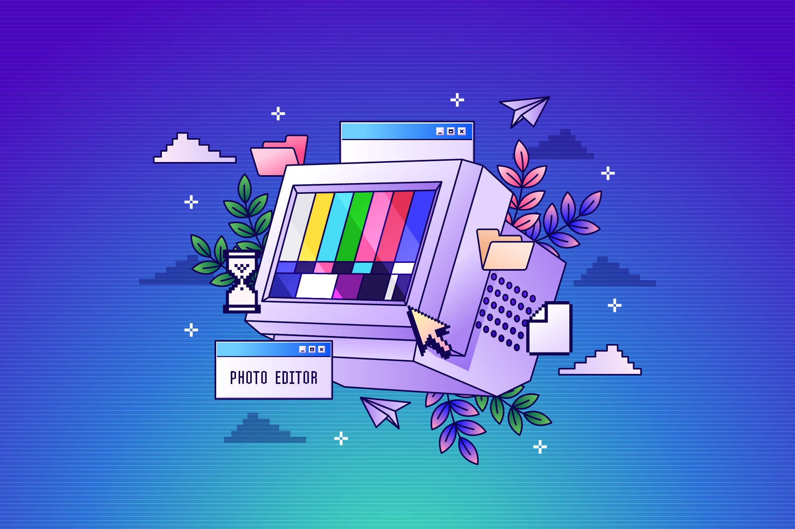
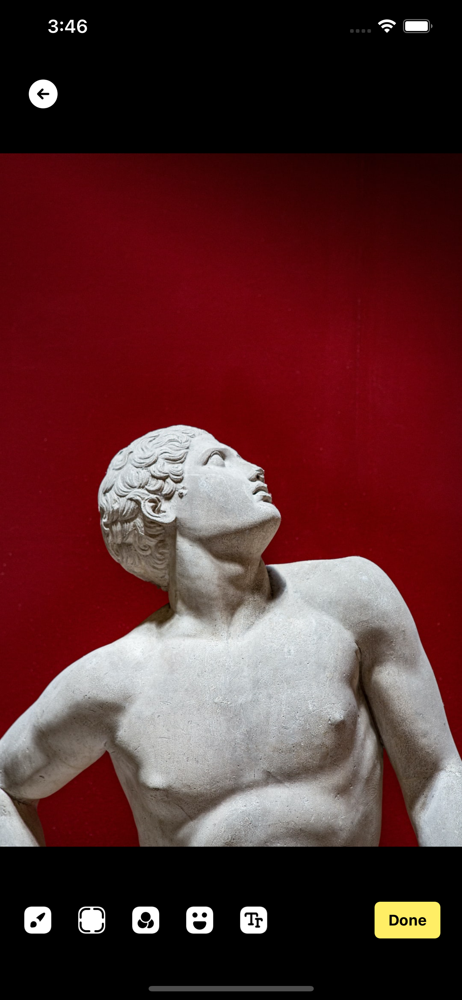
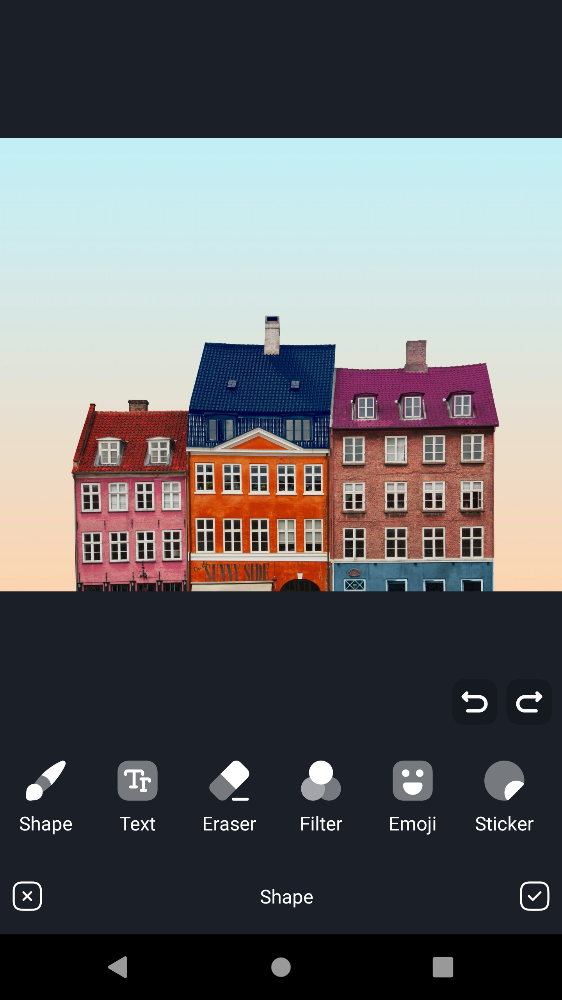
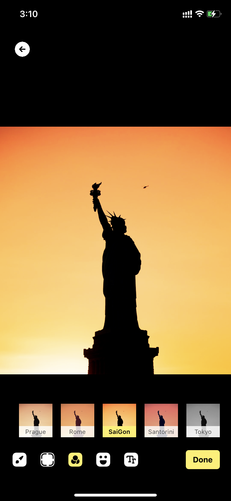
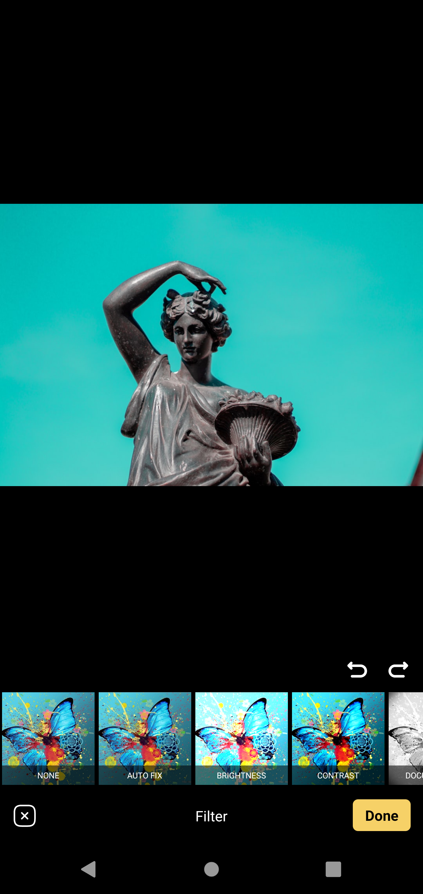

# React Native Photo Editor (RNPE)

🌄 Image editor using native modules for iOS and Android. Inherit from 2 available libraries, [Brightroom](https://github.com/muukii/Brightroom) (iOS) and [PhotoEditor](https://github.com/burhanrashid52/PhotoEditor) (Android)

<p align="center">
  
</p>

# Note
**The difference between the 2 platforms is huge - Be careful when using**<br/>
This lib is for personal use, so if you customize your style or change something, Please fork this library and check the detailed documentation in the original library:

- [iOS](https://github.com/muukii/Brightroom)
- [Android](https://github.com/burhanrashid52/PhotoEditor)

> During the development of this package. I was thinking of moving it as part of [an earlier library](https://github.com/baronha/react-native-multiple-image-picker) that I finished. If the support community for this library was large enough, I would have to dismiss this idea immediately.

## Feature 🙈

### iOS
- [Wide color editing supported](https://instagram-engineering.com/bringing-wide-color-to-instagram-5a5481802d7d)
- [Super large photo (12000px)](https://visibleearth.nasa.gov/img/temp.png) supported (But exporting takes so long time for now.)
- Blazing fast previewing by Metal power.
- Drawing supported - masking blurry
- Creating your own filter with LUT

### Android
- Drawing on image with option to change its Brush's Color, Size, Opacity, Erasing and basic shapes.
- Apply Filter Effect on image using MediaEffect
- Adding/Editing **Text** with option to change its Color with Custom Fonts.
- Adding **Emoji** with Custom Emoji Fonts.
- Adding **Images/Stickers**
- Pinch to Scale and Rotate views.
- **Undo and Redo** for Brush and Views.
- **Deleting** Views

## ScreenShot 👉👈

| iOS | Android |
| :---------------------------------: | :-------------------------------------: |
|  |  |

## Requirements

* Swift 5.3 (Xcode12.4+)
* iOS 12+

## Installation

```sh
yarn add @baronha/react-native-photo-editor && cd ios/ && pod install && cd..
```

## Usage

```js
import PhotoEditor from "@baronha/react-native-photo-editor";

// ...

const result = await PhotoEditor.open(Options);
```
## Options

| Property |  Type  | Default value | Platform | Description      |
| -------- | :----: | :-----------: | :------: | :--------------- |
| uri      | string |   required    |   both   | Local image path |

## Filters 🦋
| iOS | Android |
| :---------------------------------: | :-------------------------------------: |
|  |  |

### Custom Filters(iOS)
## LUT (Hald image)

[How to create cube data from LUT Image](https://www.notion.so/CoreImage-How-to-create-cube-data-from-LUT-Image-for-CIColorCube-CIColorCubeWithColorSpace-9e554fd418e8463abb25d6232613ac1c)

We can download the neutral LUT image from [lutCreator.js](https://sirserch.github.io/lut-creator-js/#).
### [Hald Images](https://3dlutcreator.com/3d-lut-creator---materials-and-luts.html)
> Hald is a graphical representation of 3D LUT in a form of a color table which contains all of the color gradations of 3D LUT. If Hald is loaded into editing software and a color correction is applied to it, you can use 3D LUT Creator to convert your Hald into 3D LUT and apply it to a photo or a video in your editor.

[Detailed documentations are available on here](https://www.notion.so/Creating-your-own-filters-LUT-d1942f2f5bcc44d88481d0a0cc4aacb3#d7bba7a891234ea48f1854b5e555366a)

**IMPORTANT**
You have to copy [this folder](https://github.com/baronha/react-native-photo-editor/tree/master/resources/LUTs) and paste in Xcode root folder
[See Example](https://github.com/baronha/react-native-photo-editor/tree/master/example/ios)

## To Do

- [ ] Customize.
- [ ] Sync between two platforms.
- [ ] 

## Contributing

See the [contributing guide](CONTRIBUTING.md) to learn how to contribute to the repository and the development workflow.

## License

MIT
