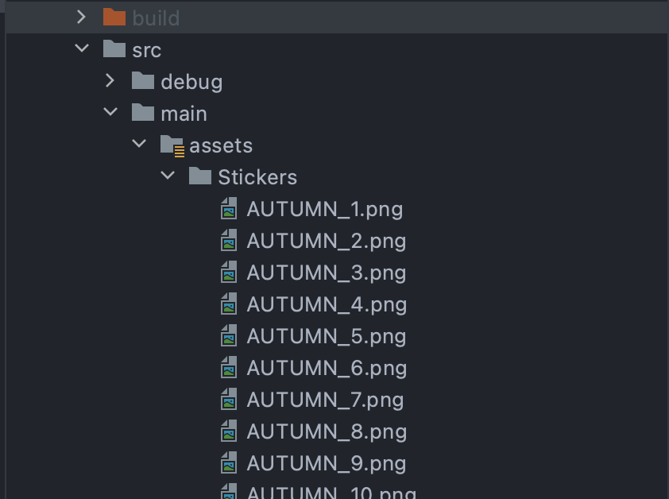

# React Native Photo Editor (RNPE)

🌄 Image editor using native modules for iOS and Android. Inherit from 2 available libraries, [ZLImageEditor](https://github.com/longitachi/ZLImageEditor) (iOS) and [PhotoEditor](https://github.com/burhanrashid52/PhotoEditor) (Android)

<p align="center">
  
</p>

# Note
**The difference between the 2 platforms is huge - Be careful when using**
<br/>
This lib is for personal use, so if you customize your style or change something, Please fork this library and check the detailed documentation in the original library:

- [iOS](https://github.com/longitachi/ZLImageEditor)
- [Android](https://github.com/burhanrashid52/PhotoEditor)

> During the development of this package. I was thinking of moving it as part of [an earlier library](https://github.com/baronha/react-native-multiple-image-picker) that I finished. If the support community for this library was large enough, I would have to dismiss this idea immediately.

> Previously this library used [Brightroom](https://github.com/muukii/Brightroom) as the native library for iOS. If you want to use Brightroom you can check it out [here](https://github.com/baronha/react-native-photo-editor/releases/tag/0.1.2).

## Feature 🙈

###  Both
- Draw (Support custom line color).
- Adding/Editing **Text** with option to change its Color.
- Adding **Images/Stickers**
- Pinch to Scale and Rotate views.

### iOS
- Apply Filter Effect on image using [LUT Color](#custom-filtersios) (Custom filter is simpler than android)
- Crop image.
### Android
- Drawing on image with option to change its Brush's Color, Size, Opacity, Erasing and basic shapes.
- Apply Filter Effect on image using [MediaEffect](https://developer.android.com/reference/android/media/effect/EffectFactory). But in the future will change to LUT color.

https://user-images.githubusercontent.com/23580920/139821324-386a08ae-4adf-4d8a-a382-352cdff6ae1c.mp4

## ScreenShot 👉👈

| iOS | Android |
| :---------------------------------: | :-------------------------------------: |
|  |  |

## Requirements

* Swift 5.1+ (Xcode12.4+)
* iOS 12+

## Installation

```sh
yarn add @baronha/react-native-photo-editor
```

### iOS
add ```use_frameworks! :linkage => :static``` in Podfile (Because this lib using SDWebImage for the purpose of loading images and stickers). 
<br>
Then run ```cd ios/ && pod install```


> Don't forget add file [.swift](https://stackoverflow.com/questions/52536380/why-linker-link-static-libraries-with-errors-ios) in your project (and create bridging header file swift).

## Usage

```js
import PhotoEditor from "@baronha/react-native-photo-editor";

// ...

const result = await PhotoEditor.open(Options);
```
## Options

| Property |  Type  | Default value | Platform | Description      |
| -------- | :----: | :-----------: | :------: | :--------------- |
| path      | string |   required    |   both   | Local/remote image path |
| [stickers](#stickers-)      | Array<String> |   []    |   both   | An array of paths containing sticker images |

## Filters 🌈
| iOS | Android |
| :---------------------------------: | :-------------------------------------: |
|  |  |

### Custom Filters(iOS)
#### LUT (Hald image)

[How to create cube data from LUT Image](https://www.notion.so/CoreImage-How-to-create-cube-data-from-LUT-Image-for-CIColorCube-CIColorCubeWithColorSpace-9e554fd418e8463abb25d6232613ac1c)

We can download the neutral LUT image from [lutCreator.js](https://sirserch.github.io/lut-creator-js/#).
#### [Hald Images](https://3dlutcreator.com/3d-lut-creator---materials-and-luts.html)
> Hald is a graphical representation of 3D LUT in a form of a color table which contains all of the color gradations of 3D LUT. If Hald is loaded into editing software and a color correction is applied to it, you can use 3D LUT Creator to convert your Hald into 3D LUT and apply it to a photo or a video in your editor.

[Detailed documentations are available on here](https://www.notion.so/Creating-your-own-filters-LUT-d1942f2f5bcc44d88481d0a0cc4aacb3#d7bba7a891234ea48f1854b5e555366a)

**IMPORTANT**
You have to create ```LUTs.bundle``` and add all your LUT Photo(Re-name your LUT Photo follow this format: [LUT_64_FILTER_NAME](https://github.com/baronha/react-native-photo-editor/tree/master/resources/LUTs.bundle)) into ```LUTs.bundle```. Then add ```LUTs.bundle``` into ```Copy Bundle Resources```. [See detail](https://github.com/baronha/react-native-photo-editor/tree/master/example/ios)

## Stickers 🤌
### Remote
You need to pass an array of image urls to the sticker parameter in [options](#options)
[Example](https://github.com/baronha/react-native-photo-editor/blob/dev/example/src/assets/data/stickers.json): 
```
[
  "https://cdn-icons-png.flaticon.com/512/5272/5272912.png",
  "https://cdn-icons-png.flaticon.com/512/5272/5272913.png",
  "https://cdn-icons-png.flaticon.com/512/5272/5272916.png",
  ...
] 
```
### Local

#### iOS
You have to create ```Stickers.bundle``` and add all your sticker into ```Stickers.bundle```. Then add ```Stickers.bundle``` into ```Copy Bundle Resources```.
  [See detail](https://github.com/baronha/react-native-photo-editor/tree/master/example/ios)
    <br>
    <br>

  
#### Android
You have to create ```Stickers``` folder inside ```assets``` folder. Then drag or copy all sticker in to ```Sticker``` folder. 
  [See detail](https://github.com/baronha/react-native-photo-editor/tree/master/example/android/app/src/main/assets/Stickers)
  <br>
   <br>
  
## To Do

- [ ] Lut Color in android.
- [ ] Crop Image in android.

## Performance

We're trying to improve performance. If you have a better solution, please open a [issue](https://github.com/baronha/react-native-photo-editor/issues)
or [pull request](https://github.com/baronha/react-native-photo-editor/pulls). Best regards!

## Contributing

See the [contributing guide](CONTRIBUTING.md) to learn how to contribute to the repository and the development workflow.

## License

MIT
